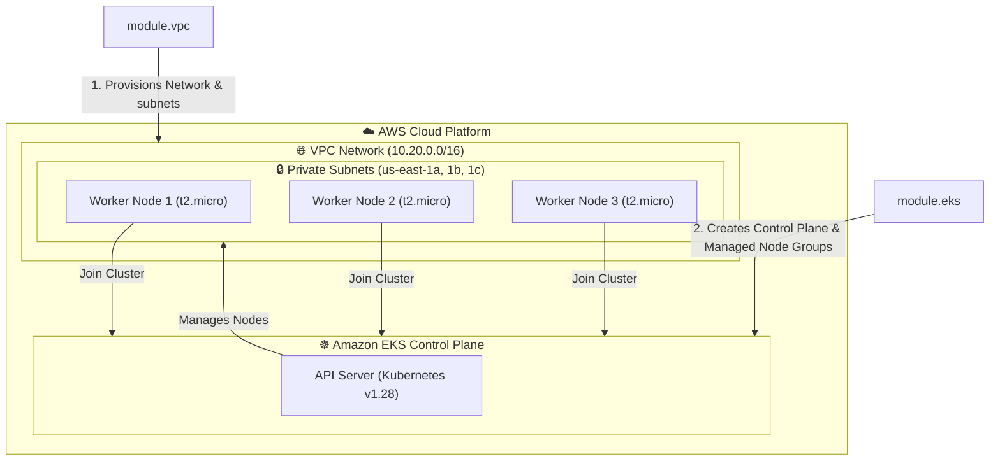

# Amazon EKS Cluster Infrastructure Deployment


This repository contains the root Terraform configuration to deploy a fully-managed **Amazon Elastic Kubernetes Service (EKS)** cluster in AWS. The infrastructure is built on top of our custom AWS VPC module (`module-tf-aws-vpc`).

---

## 📐 EKS Cluster & Network Topology

The diagram below details how the root module composes the network layer and managed node group to deploy the EKS cluster:



---

## 📂 Repository Structure

* **[cluster.tf](file://cluster.tf)**: Orchestrates the VPC creation using `module-tf-aws-vpc` (version `v1.0.0`) and EKS cluster creation using the official registry module (version `19.21.0`). Configures EKS Managed Node Group with auto-joining worker nodes (`t2.micro`).
* **[provider.tf](file://provider.tf)**: AWS provider setup. Region defaults to `var.region_common`.
* **[variables.tf](file://variables.tf)**: Configuration variables declarations (region, VPC CIDR, profile).
* **[versions.tf](file://versions.tf)**: Enforces required Terraform version (`>= 1.0`) and pins provider versions (`aws ~> 4.57` and `kubernetes ~> 2.10.0`) to avoid conflicts and deprecated warnings.
* **[outputs.tf](file://outputs.tf)**: Exports EKS cluster ID and ARN.

---

## 🚀 How to Run & Deploy

### 1. Configure AWS CLI Credentials
Ensure you have configured your local AWS CLI credentials profile:
```sh
aws configure
```

### 2. Initialize and Deploy
Initialize Terraform (downloads AWS and Kubernetes providers along with the referenced submodules):
```sh
terraform init
```
Generate and review deployment plan:
```sh
terraform plan
```
Apply and provision the EKS cluster (usually takes 10-15 minutes):
```sh
terraform apply
```

### 3. Connect to EKS Cluster
Once the cluster is successfully provisioned, configure local `kubectl` access:
```sh
aws eks update-kubeconfig --region us-east-1 --name my-eks-cluster
```
Verify the worker nodes are ready:
```sh
kubectl get nodes
```

---

## 🛡️ CI/CD Validation
This repository has an active GitHub Actions workflow configured in `.github/workflows/validate.yml`. Upon every push to the `master` branch or pull requests, it automatically validates the configuration using Terraform version `1.5.7` to ensure syntax compliance and prevent deployment failures.
